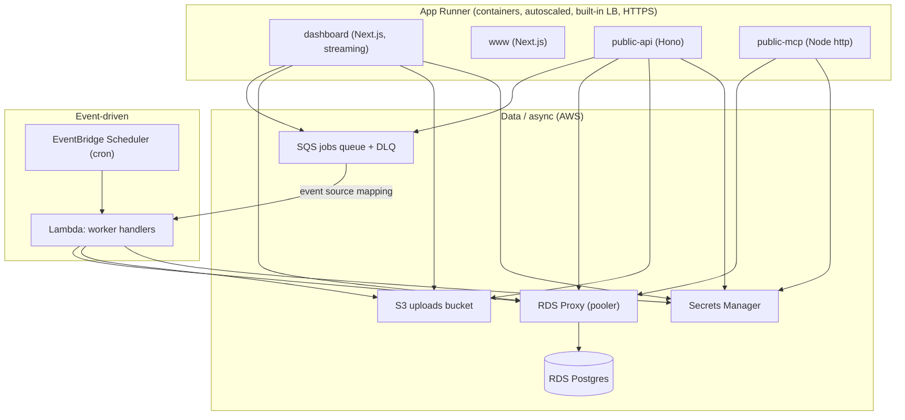

# AWS App Runner Deploy Profile (low-ops, compliance-aware)

**Date:** 2026-07-07
**Status:** Draft

## Overview

Evolve the existing `infra/aws` profile from ECS Fargate to a lower-maintenance,
lower-cost shape that still meets the monorepo's zero-downtime and compliance
requirements:

- **Web tier (dashboard, www, public-api, public-mcp) → AWS App Runner** —
  managed containers with built-in autoscaling, load balancing, HTTPS, and
  rolling health-gated deploys. No ALB and no ECS cluster.
- **Workers → SQS-triggered AWS Lambda** — an additive Lambda entrypoint that
  reuses the existing handler registry; SQS + DLQ provide retries and
  at-least-once delivery. Replaces the always-on poller for the AWS profile only.
- **Scheduled jobs → EventBridge Scheduler** — replaces BullMQ repeatable jobs on
  the AWS profile.
- **Database → RDS Postgres + RDS Proxy** — RDS Proxy is the transaction pooler
  that solves connection exhaustion under serverless/autoscaled compute, and
  smooths Multi-AZ failover. Keeps Postgres under the single AWS BAA.
- **Compliance-aware** — compliance *features* (KMS/CMEK, audit logging, immutable
  log retention, WAF, interface VPC endpoints, Multi-AZ) hinge off the existing
  `infra/shared/compliance.ts` `resolveCompliance(mode)` flags, exactly like the
  GCP profile. The **network topology is constant across all modes** (always
  private VPC + RDS Proxy in-VPC + NAT); `complianceMode` only layers features on
  top, so sandbox mirrors production's connectivity.

This profile targets three environments — `sandbox`, `staging`, `production` — at
parity with the GCP profile. App code changes are **additive** and must not break
the other cloud profiles (GCP, Azure, Render, Vercel) that share the same apps.

### Goals

- Lowest reasonable fixed cost and operational burden on AWS.
- All services HIPAA-eligible; full HIPAA/SOC2 posture toggled by `complianceMode`.
- Zero-downtime deploys consistent with `infra/README.md` rules.
- No regressions to non-AWS profiles.

### Non-goals

- Deleting BullMQ / Redis support or the `/api/jobs/drain` route (used by the
  Vercel/Render profiles).
- Canary / blue-green traffic splitting (App Runner is rolling-only; accepted
  trade-off, see Zero-downtime).
- Signing third-party BAAs or scrubbing PHI from LLM/observability providers
  (tracked as compliance surface, out of scope for this infra change).

---

## Architecture



### Component mapping (from `infra/shared/apps.manifest.ts`)

| App | Target | Public | Needs DB | Needs SQS | Needs S3 |
|-----|--------|--------|----------|-----------|----------|
| `dashboard` | App Runner | ✓ | ✓ | ✓ (producer) | ✓ |
| `www` | App Runner | ✓ | — | — | — |
| `public-api` | App Runner | ✓ | ✓ | ✓ (producer) | ✓ |
| `public-mcp` | App Runner | ✓ | ✓ | — | — |
| `workers` | Lambda (SQS-triggered) | — | ✓ | ✓ (consumer) | ✓ |

All five images already exist via `infra/shared/docker/Dockerfile.*` (and
`apps/workers/Dockerfile`). App Runner consumes the four web images from ECR;
the workers Lambda is packaged from the workers build (container image or zip).

---

## Compliance hinge

Reuse `resolveCompliance(mode)` from `infra/shared/compliance.ts` — **no new
compliance abstraction**. Map its existing boolean flags to AWS resources:

| `ComplianceConfig` flag | AWS mapping |
|-------------------------|-------------|
| `cmek` | KMS CMKs applied to RDS, S3 (SSE-KMS), SQS, Secrets Manager, EBS, CloudWatch Logs |
| `auditLogs` | CloudTrail trail with data events (S3, Secrets Manager); VPC Flow Logs when private |
| `immutableLogSink` | S3 log bucket with **Object Lock** (compliance mode), retention = `logRetentionDays` |
| `logRetentionDays` | CloudWatch Logs retention + S3 Object Lock retention |
| `orgPolicies` | AWS Config managed rules / SCP guardrails (e.g. deny public RDS, require encryption) |
| `cloudArmor` | AWS WAF WebACL associated with App Runner services |
| `vpcServiceControls` | Interface VPC endpoints (PrivateLink) for AWS APIs |
| `mode !== "none"` | Compliance *features* only — **not** the network topology (see below) |

`resolveCompliance` currently returns GCP-flavored flags; keep the type as-is and
interpret them in an AWS `compliance-resources.ts` (mirrors
`infra/gcp/bootstrap/compliance-resources.ts`). When every flag is false
(`mode: "none"`) the compliance module is a no-op and registers no resources.

### Networking posture — one topology for every environment

**Decision:** to eliminate sandbox↔prod drift and reduce branching/errors, **all
environments use a single network topology** regardless of `complianceMode`. RDS is
always private, RDS Proxy is always in-VPC, App Runner always uses a VPC egress
connector, Lambda always runs in private subnets, and a NAT gateway (plus a free S3
gateway endpoint) always handles egress. `complianceMode` toggles only compliance
*features* layered on top of that constant topology — it never changes how the app
connects, so a deploy that passes in sandbox exercises the same network paths as
production.

| Aspect | All environments (constant) | Extra when `complianceMode != none` |
|--------|-----------------------------|--------------------------------------|
| RDS | Private subnets, RDS Proxy **in-VPC** | Multi-AZ, CMEK at rest |
| App Runner → DB | **VPC egress connector** → RDS Proxy | WAF WebACL |
| Lambda | **In-VPC**, private subnets | — |
| Egress | Single **NAT gateway** + free S3 gateway endpoint | Per-AZ **HA NAT** + interface VPC endpoints (SQS/Secrets Manager/KMS/ECR/Logs) |
| Encryption in transit | TLS (`sslmode=require`), HTTPS | Enforced via policy |
| Audit / logging | Baseline CloudWatch | CloudTrail data events, VPC Flow Logs, Object-Lock log bucket |

Accepted trade-off: the single topology adds a NAT gateway (~$32/mo) to the
non-production environments that would otherwise skip it. This is the deliberate
cost of fidelity and simplicity; production already carried NAT, so it is unchanged.
Interface VPC endpoints remain compliance-gated because they are a routing/security
optimization, not an app-connectivity change — gating them does not reintroduce
sandbox↔prod drift.

> **GCP parity:** the GCP profile currently uses a two-topology split
> (`bootstrap.privateNetwork: false` in sandbox, `true` in prod). Unifying GCP onto
> a single always-private topology to match this decision is tracked as a **separate
> spec + implementation plan** (it changes the existing GCP profile and the
> `infra/README.md` cost table) and is out of scope for this document.

---

## Environment config (typed, mirrors GCP)

Bring AWS to the same typed-config pattern the GCP profile uses
(`infra/gcp/config.*.ts` + `composeEnvConfig`). Introduce
`infra/shared/aws-env-config.ts` and:

- `infra/aws/config.common.ts` — shared invariants (region, domains, db version),
  `complianceMode: "none"` base.
- `infra/aws/config.sandbox.ts` — `none`, smallest RDS (single-AZ), single NAT.
- `infra/aws/config.staging.ts` — inherits production; `soc2`; single-AZ RDS; single NAT.
- `infra/aws/config.production.ts` — `soc2` (or `hipaa`), Multi-AZ RDS, per-AZ HA NAT, WAF, monitoring.

All environments share the same network topology (see Networking posture);
`complianceMode` and instance sizing are the only per-env deltas.

Config is secret-free and safe to commit; real secrets live in Secrets Manager.

---

## Per-app deployment

### App Runner (4 web apps)

- One App Runner service per app, image pulled from ECR (SHA-pinned tag).
- Auto Scaling config: `MinSize: 1` (warm), `MaxSize` per env, `MaxConcurrency` tuned per app.
- Health check → each app's `healthPath` (`/api/health` or `/health` from the manifest).
- Env vars from config; secrets (`DATABASE_URL`, `BETTER_AUTH_SECRET`, Stripe, Resend, LLM keys) injected from Secrets Manager.
- HTTPS endpoints via App Runner; custom domains mapped per env (apex/www/app/api/mcp), mirroring the GCP host-routing scheme.
- Streaming (AI chat `toUIMessageStreamResponse`) works — long-lived container, no buffering/timeout limit. This is why App Runner replaces Amplify.

### Workers (SQS → Lambda)

New additive entrypoint `apps/workers/src/lambda.ts` reusing `handlers` +
`getHandler` + `parseJobEnvelope`:

```ts
export async function handler(event: SQSEvent): Promise<SQSBatchResponse> {
  const batchItemFailures: { itemIdentifier: string }[] = [];
  for (const record of event.Records) {
    try {
      const envelope = parseJobEnvelope(JSON.parse(record.body));
      await getHandler(handlers, envelope.event as EventName)(envelope.payload as never);
    } catch (err) {
      console.error(`[workers] failed ${record.messageId}`, err);
      batchItemFailures.push({ itemIdentifier: record.messageId });
    }
  }
  return { batchItemFailures };
}
```

- Event source mapping with `ReportBatchItemFailures`; failures redrive to the
  existing DLQ (`maxReceiveCount: 5` in `infra/aws/core`).
- The existing poller (`apps/workers/src/index.ts`) stays intact for other
  profiles; Lambda is an alternate entrypoint, not a replacement.
- Poison messages (bad JSON) go to the DLQ via `batchItemFailures` rather than
  being silently dropped.

### Scheduled jobs (EventBridge Scheduler)

Repeatable jobs currently registered via BullMQ (`registerRepeatableJobs`, e.g.
`cleanup.expired-sessions`) become EventBridge Scheduler rules that enqueue an
SQS message (preferred) or invoke the workers Lambda directly. One rule per
scheduled event; schedule expressions in env config.

---

## Database & connection pooling

- RDS Postgres from the evolved `infra/aws/core` (keep `deletionProtection`,
  `backupRetentionPeriod`; Multi-AZ when `complianceMode !== none`).
- **RDS Proxy** added as the transaction pooler. Runtime traffic → proxy; DDL →
  direct RDS endpoint.
- Split connection strings across the whole monorepo (benefits every profile):
  - `DATABASE_URL` → pooled (RDS Proxy / provider pooler).
  - `DIRECT_URL` → direct endpoint, used by `prisma migrate deploy` and any
    session-requiring operations.
- Wire `DIRECT_URL` into `packages/database/keys.ts` and `prisma.config.ts`
  (currently only `DATABASE_URL` is read). The Prisma client keeps using
  `DATABASE_URL`; migrations use `DIRECT_URL`.
- Prisma uses `@prisma/adapter-pg` (node-postgres), which does not use
  protocol-level prepared statements by default — compatible with transaction
  pooling without extra flags. Cap the pg pool `max` per process to bound
  connections.

---

## Secrets & env

- Secrets Manager holds `DATABASE_URL`, `DIRECT_URL`, `BETTER_AUTH_SECRET`,
  `CAMPAIGN_UNSUBSCRIBE_SECRET`, and placeholders for Stripe/Resend/LLM keys
  (created empty, populated out-of-band — mirrors GCP secrets layer).
- App Runner services and the workers Lambda read secrets via IAM +
  Secrets Manager references (no plaintext in config or images).
- No local secret files are read; `.env.example` remains the only reference
  (per `.ai/conventions/secrets-files.md`).

---

## CI/CD

Extend the existing `deploy-aws.yml` scaffold, mirroring `app-release.yml`:

```
build 5 images → push ECR (SHA-pinned)
  → prisma migrate deploy (DIRECT_URL)          # gate (backward-compatible only)
  → App Runner update-service ×4 (rolling, health-gated)
  → Lambda update-function-code + publish (workers)
  → smoke test GET healthPath on dashboard
```

- OIDC (no long-lived keys); `production-aws` GitHub Environment with required
  reviewers.
- Rollback = redeploy previous SHA-pinned image (App Runner) / previous Lambda
  version.

---

## Zero-downtime

Maps to the five rules in `infra/README.md`:

1. **Health-gated deploys** — App Runner rolling deploy shifts traffic only to
   healthy instances; Lambda version publish is atomic.
2. **Expand/contract migrations** — enforced; migrate runs as a pre-traffic gate
   against `DIRECT_URL`.
3. **Graceful drain** — App Runner drains connections on SIGTERM; workers drain
   is handled by SQS visibility timeout + redelivery (no custom drain needed).
4. **Backward-compatible message contracts** — SQS envelopes must stay
   backward-compatible across concurrent old/new versions.
5. **Rollback** — redeploy prior SHA-pinned image / prior Lambda version.
   **Caveat:** App Runner has no native canary/blue-green and rollback is a
   rolling redeploy (minutes), not an instant traffic shift like Cloud Run —
   accepted trade-off; SHA-pinned tags make redeploy-rollback fast.

RDS Proxy additionally smooths Multi-AZ failover (holds/queues connections),
keeping DB maintenance close to zero-downtime.

---

## Cost (indicative, low traffic, `us-east-1`, single topology)

| Component | sandbox (`none`) | staging (`soc2`) | production (`soc2`/`hipaa`) |
|-----------|------------------|------------------|------------------------------|
| App Runner ×4 | ~$20 | ~$30 | ~$60–100 |
| RDS | ~$14 (micro, 1-AZ) | ~$27 (small, 1-AZ) | ~$100+ (medium, Multi-AZ) |
| RDS Proxy | ~$22 | ~$22 | ~$22 |
| NAT gateway | ~$32 (single) | ~$32 (single) | ~$65 (per-AZ HA) |
| Interface VPC endpoints | — | ~$22 | ~$44–88 |
| WAF / CloudTrail / KMS | — | ~$15 | ~$25 |
| Lambda + SQS + S3 | ~$2 | ~$3 | ~$10 |
| ALB / cluster | $0 | $0 | $0 |
| **≈ Total** | **~$90/mo** | **~$150/mo** | **~$300–380/mo** |

The single-topology decision adds ~$32/mo (one NAT gateway) to sandbox/staging
versus a two-topology design; production is unchanged (it already carried NAT).
Cost is dominated by the RDS tier, which is tunable per env. Still no ALB, no
cluster, and no always-on Fargate tasks (the prior scaffold ran ~$95–120+ before
DB). Rollback/canary caveats unchanged (see Zero-downtime).

---

## Critical Tests

- `apps/workers/src/lambda.test.ts`: SQS batch handler dispatches each record to
  the correct handler via `getHandler`; a handler throw adds only that
  `messageId` to `batchItemFailures` (partial-batch), others still ack; invalid
  JSON envelope is reported as a failure (redrives to DLQ), not silently dropped.
- `packages/database/keys.test.ts`: schema requires `DATABASE_URL`; `DIRECT_URL`
  optional and falls back to `DATABASE_URL` when unset; invalid URLs rejected.
- `infra/shared/aws-env-config.test.ts`: `composeEnvConfig` merges
  common→env→overrides; `complianceMode` propagates; sandbox resolves to `none`,
  production to `soc2`/`hipaa`.
- `infra/aws/compliance-resources.test.ts` (mock): `mode: "none"` registers zero
  compliance resources; `hipaa` enables CMEK, CloudTrail data events, Object-Lock
  log bucket with `logRetentionDays`, WAF, and interface VPC endpoints — while the
  base network topology (private RDS, VPC connector, NAT) is created in every mode.
- `infra/shared/compliance.test.ts` (existing): unchanged behavior of
  `resolveCompliance` for all four modes (regression guard, since AWS now reuses it).

List colocated test paths only. Favor fast unit/mock tests over E2E.

## Verification

- `pnpm type-check`
- `pnpm lint`
- `pnpm --filter @apps/workers test`
- `pnpm --filter @workspace/database test`
- `pnpm --filter ./infra/... test` (env-config + compliance mock tests)
- `pulumi preview` (sandbox) with the CrossGuard policy pack
