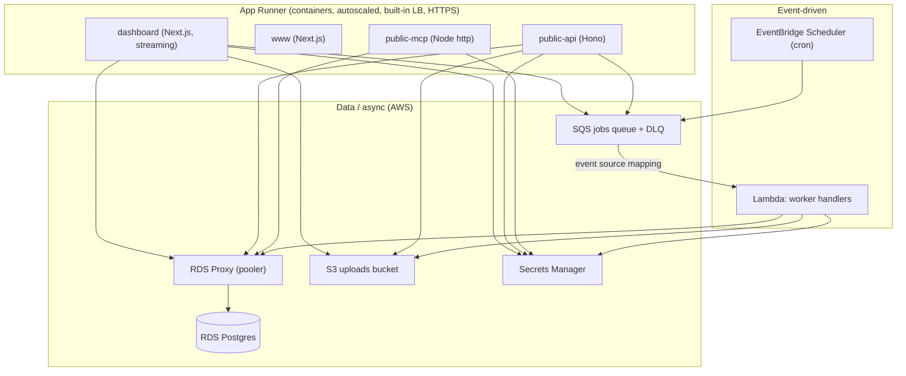

# AWS (Pulumi) — App Runner Profile

App Runner + Lambda + RDS Postgres + RDS Proxy across three environments: sandbox, staging, and production.

> [!TIP]
> **New here?** Start with [`GETTING_STARTED.md`](./GETTING_STARTED.md) — it covers
> the account-per-environment setup, the "credentials decide the account" golden
> rule, what's manual vs. codified, and the exact deploy order.

Three Pulumi projects live here:

| Project                 | Path                   | What it owns                                                                                                                                                                                       |
| ----------------------- | ---------------------- | -------------------------------------------------------------------------------------------------------------------------------------------------------------------------------------------------- |
| `starter-aws-bootstrap` | `infra/aws/bootstrap/` | Per-account foundations: GitHub OIDC deploy role, ECR repository, cost budget. Run once per account with admin credentials.                                                                        |
| `starter-aws-core`      | `infra/aws/core/`      | VPC, RDS Postgres, RDS Proxy, SQS queue registry (+ automatic DLQs), S3 uploads bucket, Secrets Manager entries (derived + manual placeholders), EventBridge Scheduler rules, compliance resources |
| `starter-aws-apps`      | `infra/aws/apps/`      | 4 App Runner services (dashboard, www, public-api, public-mcp), workers Lambda, App Runner VPC connector                                                                                           |

`apps` depends on `core` via `pulumi.StackReference`. Deploy order: `bootstrap` → `core` → `apps`.

---

## Architecture



### Component mapping

| App          | Target                 | Public | Needs DB | Needs SQS    | Needs S3 |
| ------------ | ---------------------- | ------ | -------- | ------------ | -------- |
| `dashboard`  | App Runner             | ✓      | ✓        | ✓ (producer) | ✓        |
| `www`        | App Runner             | ✓      | —        | —            | —        |
| `public-api` | App Runner             | ✓      | ✓        | ✓ (producer) | ✓        |
| `public-mcp` | App Runner             | ✓      | ✓        | —            | —        |
| `workers`    | Lambda (SQS-triggered) | —      | ✓        | ✓ (consumer) | ✓        |

### Workers Lambda

The workers service runs as an SQS-triggered Lambda container image with handler `lambda.handler`. An EventSourceMapping with `ReportBatchItemFailures` and `batchSize: 10` provides partial-batch failure semantics — a record that throws is reported via `batchItemFailures` and redrives to the DLQ (`maxReceiveCount: 5`) rather than blocking the batch. The poller-based entrypoint (`apps/workers/src/index.ts`) remains intact for other profiles.

### Scheduled jobs

An EventBridge Scheduler rule enqueues the `cleanup.expired-sessions` job to SQS on cron `0 3 * * *`. Additional repeatable jobs follow the same pattern: one scheduler rule enqueues one SQS message; the workers Lambda consumes it.

---

## Network topology (same in every environment)

**All environments — sandbox, staging, and production — share one network topology.** RDS is always private, RDS Proxy is always in-VPC, App Runner always uses a VPC egress connector, and Lambda always runs in private subnets. A NAT gateway (plus a free S3 gateway endpoint) handles egress. `complianceMode` toggles compliance _features_ layered on top of this constant topology; it never changes how the app connects, so a deploy that passes in sandbox exercises the same network paths as production.

| Aspect                | All environments (constant)                   | Extra when `complianceMode != none`                                                |
| --------------------- | --------------------------------------------- | ---------------------------------------------------------------------------------- |
| RDS                   | Private subnets, RDS Proxy in-VPC             | Multi-AZ, CMEK at rest                                                             |
| App Runner → DB       | VPC egress connector → RDS Proxy              | WAF WebACL (see known limitations)                                                 |
| Lambda                | In-VPC, private subnets                       | —                                                                                  |
| Egress                | Single NAT gateway + free S3 gateway endpoint | Per-AZ HA NAT + interface VPC endpoints (SQS / Secrets Manager / KMS / ECR / Logs) |
| Encryption in transit | TLS (`sslmode=require`), HTTPS                | Enforced via policy                                                                |
| Audit / logging       | Baseline CloudWatch                           | CloudTrail data events, VPC Flow Logs, Object-Lock log bucket                      |

Accepted trade-off: the single topology adds ~$32/mo (one NAT gateway) to sandbox/staging compared with a two-topology design; production already carried NAT and is unchanged.

---

## Compliance features (`complianceMode` toggles)

`complianceMode` is set per environment in `infra/aws/config.<env>.ts`. It layers features onto the constant topology but does **not** change network connectivity.

| `ComplianceConfig` flag | AWS mapping                                                                      |
| ----------------------- | -------------------------------------------------------------------------------- |
| `cmek`                  | KMS CMKs for RDS, S3 (SSE-KMS), SQS, Secrets Manager, CloudWatch Logs            |
| `auditLogs`             | CloudTrail trail with data events (S3, Secrets Manager); VPC Flow Logs           |
| `immutableLogSink`      | S3 log bucket with Object Lock (compliance mode), retention = `logRetentionDays` |
| `logRetentionDays`      | CloudWatch Logs retention + S3 Object Lock retention                             |
| `orgPolicies`           | AWS Config managed rules (deny public RDS, require encryption, etc.)             |
| `cloudArmor`            | AWS WAF WebACL (see known limitations below)                                     |
| `vpcServiceControls`    | Interface VPC endpoints (PrivateLink) for AWS APIs                               |

When `complianceMode: "none"` (sandbox default) the compliance module is a no-op and registers no extra resources.

### Known limitations

**WAF WebACL association for public App Runner services is currently inert.** The core compliance module creates the WebACL but does not yet export its ARN for use by the apps layer. As a result, WAF is not actively filtering traffic even when `complianceMode` is `soc2` or `hipaa`. This is a known gap tracked for a follow-up; do not treat WAF as active until the ARN export and association are wired up.

---

## Database connection pooling

Runtime traffic uses a **pooled** connection through RDS Proxy; schema migrations use a **direct** connection to the RDS instance:

| Secret         | Endpoint                   | Used by                                |
| -------------- | -------------------------- | -------------------------------------- |
| `DATABASE_URL` | RDS Proxy `:5432` (pooled) | App Runner services, Lambda at runtime |
| `DIRECT_URL`   | RDS instance (direct)      | `prisma migrate deploy` only           |

Both secrets live in Secrets Manager and are injected at runtime via IAM. The Prisma client uses `DATABASE_URL`; Prisma Migrate uses `DIRECT_URL`. Cap the pg pool `max` per process to bound connections through the proxy.

---

## Extending: queues & secrets

Both are driven by small registries in `core/` so you add capacity without
hand-wiring resources (details + examples in [`GETTING_STARTED.md`](./GETTING_STARTED.md)):

- **SQS queues** — append a `QueueSpec` to `core/queues.ts`; each entry gets a
  dead-letter queue + redrive policy automatically. Names: `starter-<key>-<env>`
  and `starter-<key>-dlq-<env>`. New queues need a consumer wired in the apps
  stack. The `jobs` queue is load-bearing — keep its key stable.
- **Manual secrets** — append a `ManualSecretSpec` to `core/manual-secrets.ts` for
  third-party keys Pulumi can't derive. Pulumi creates an **empty** placeholder
  secret; you set the real value once via console/CLI and Pulumi never overwrites
  it (`ignoreChanges`). Real values never live in git. Derived connection-string
  secrets remain fully managed by Pulumi.

---

## Hybrid mode: Vercel apps + AWS data/AI plane

For a Vercel-hosted frontend that uses this AWS data/AI plane **without** Vercel
Secure Compute, `core` provisions two extra pieces (design spec:
[`docs/superpowers/specs/2026-07-10-vercel-aws-hybrid-data-ai-plane-design.md`](../../docs/superpowers/specs/2026-07-10-vercel-aws-hybrid-data-ai-plane-design.md)):

| Piece                   | Module                  | Purpose                                                                                                                                                                                                 |
| ----------------------- | ----------------------- | ------------------------------------------------------------------------------------------------------------------------------------------------------------------------------------------------------- |
| Vercel OIDC access role | `core/vercel-access.ts` | Keyless, least-privilege role Vercel assumes (S3 uploads, SQS produce, app secrets, Bedrock InvokeModel). Created when `access.vercelOidc.teamSlug` is set.                                             |
| Public PgBouncer pooler | `core/pgbouncer.ts`     | Transaction-mode PgBouncer (Fargate, private subnets) behind a public NLB on `:6432`. RDS and RDS Proxy stay private — PgBouncer is the only public DB surface. Created when `database.pooler.enabled`. |

Bedrock is a public regional API: the Vercel role and the in-AWS App Runner /
Lambda roles get `bedrock:InvokeModel*` scoped to `ai.bedrockModels`. See
[infra/vercel/README.md](../vercel/README.md) for the Vercel-side wiring
(`AWS_ROLE_ARN`, `AWS_REGION`, pooled `DATABASE_URL`).

### Connection paths

| Consumer                   | Postgres path                                | Auth                              |
| -------------------------- | -------------------------------------------- | --------------------------------- |
| Vercel apps                | public NLB `:6432` → PgBouncer → private RDS | OIDC role + `sslmode=verify-full` |
| In-AWS App Runner / Lambda | private RDS Proxy `:5432` → RDS              | task role                         |

### Public pooler allowlist configuration

The public PgBouncer pooler is protected by a network load balancer security
group that allowlists specific individual IP addresses (canonical `/32`
CIDRs). Only addresses in
`AWS_POOLER_APP_EGRESS_CIDRS` and `AWS_POOLER_DEVELOPER_CIDRS` (defined in
`infra/.env.local`) can connect to `:6432`.

#### Application hosting provider requirements

**Hosting providers must supply stable outbound addresses.** Dynamic egress
addresses (such as ephemeral NAT IPs, rotating proxies, or shared pools without
static allocation) cannot be reliably allowlisted and will result in intermittent
connection failures.

- The current deployment purchases **Vercel Static IPs** only for `dashboard`
  and `patient-account`. Enter every assigned Vercel Static IP address as a
  `/32` entry in `AWS_POOLER_APP_EGRESS_CIDRS`, comma-delimited.
- **Render**, **Fly.io**, and other providers work the same way when they
  expose stable outbound addresses. Consult your provider's documentation for
  static IP offerings.
- **Vercel OIDC** continues to provide temporary AWS credentials and scoped AWS
  API access (S3, SQS, Bedrock), but it does **not** authenticate PostgreSQL or
  replace the network allowlist. TLS and SCRAM credentials remain required.
- **Vercel Static IPs use shared infrastructure** provisioned for multiple
  customers. TLS (`sslmode=verify-full`), SCRAM credentials, credential
  rotation, OIDC scoping, and audit controls remain required. Static IP
  allowlisting is one control layer, not proof of HIPAA compliance.
- **Production database credentials must not be exposed to preview
  deployments.** Use environment-specific secrets and ensure preview branches
  cannot access production database credentials or connection strings.
- **Keep Vercel build traffic outside the Static IP path** unless a reviewed
  build step genuinely needs database connectivity. Most builds should use
  stubbed or mock data rather than production pooler access.
- **AWS Lambda workers** connect privately through RDS Proxy and require
  neither Static IPs nor public PgBouncer access. Lambda functions run in
  private subnets and use the in-VPC RDS Proxy endpoint.

#### Developer workstation access

Multiple developers append comma-delimited `/32` entries to
`AWS_POOLER_DEVELOPER_CIDRS`. Each developer's residential or VPN IP must be
listed individually in `/32` notation. A changed residential IP requires editing
`AWS_POOLER_DEVELOPER_CIDRS` in `infra/.env.local` and rerunning:

```bash
AWS_PROFILE=starter-sandbox pnpm infra:aws core up -s sandbox
```

Each CIDR must be a canonical `/32` (a single IP address). The deployment
rejects broader ranges such as `/24`, non-canonical CIDRs, IPv6, and
`0.0.0.0/0`. This is enforced at deploy time to prevent accidental public
exposure.

#### Credential rotation

Database credentials must be rotated through the existing secret-management
procedure. **Do not print connection URLs or secret values** in build logs, CI
output, or terminal commands. Credentials are injected at runtime via Secrets
Manager; manual rotation requires updating the secret value in Secrets Manager
and restarting services.

To rotate the RDS password:

1. Generate a new password and update the RDS instance via console or CLI.
2. Update the Secrets Manager secrets (`/starter/<env>/database-url`,
   `/starter/<env>/direct-url`, `/starter/<env>/vercel-database-url`) with the
   new password.
3. Restart App Runner services and redeploy Lambda functions to pick up the new
   credentials.

**Never commit connection strings or credentials to version control.**

### Bedrock invocation logging (deploy step)

The pinned `@pulumi/aws` does not expose the model-invocation logging resource,
so enable prompt/completion logging once per account/region after `pulumi up`:

```sh
aws bedrock put-model-invocation-logging-configuration --logging-config '{
  "cloudWatchConfig": { "logGroupName": "/starter/<env>/bedrock-invocations", "roleArn": "<bedrock-logs-role-arn>" },
  "textDataDeliveryEnabled": true, "embeddingDataDeliveryEnabled": true
}'
```

CloudTrail already records Bedrock control-plane management events.

### Certificate renewal and incident checks

The ACM certificate for `db.<env>.aws.<root-domain>` renews automatically when
DNS validation succeeds. The TLS delivery Lambda polls ACM every 6 hours and
updates the NLB listener with the latest certificate ARN. An SNS topic alerts
the configured email address when certificate expiration is approaching or when
renewal fails.

#### Routine checks

Run these commands to verify certificate and pooler health:

```bash
# ACM certificate status
aws acm list-certificates --profile starter-<env> --region us-east-2
aws acm describe-certificate --certificate-arn <cert-arn> \
  --profile starter-<env> --region us-east-2

# Lambda function errors (TLS delivery)
aws logs tail /aws/lambda/<function-name> --follow \
  --profile starter-<env> --region us-east-2

# CloudWatch alarms (certificate expiration, Lambda errors)
aws cloudwatch describe-alarms --profile starter-<env> --region us-east-2

# Current ECS deployment (PgBouncer Fargate service)
aws ecs describe-services --cluster <cluster-name> \
  --services <service-name> --profile starter-<env> --region us-east-2

# Certificate expiration date
openssl s_client -starttls postgres \
  -connect db.<env>.aws.example.com:6432 \
  -servername db.<env>.aws.example.com < /dev/null 2>/dev/null | \
  openssl x509 -noout -dates
```

Replace `<env>` with `sandbox`, `staging`, or `production`, and substitute your
real `AWS_DNS_ROOT_DOMAIN` for `example.com`.

#### Incident response

If certificate validation fails, verify:

1. The Route 53 hosted zone `<env>.aws.<root-domain>` is delegated correctly at
   the external DNS provider (see [GETTING_STARTED.md](./GETTING_STARTED.md)).
2. The NS record set at the external provider contains all four AWS name servers.
3. Public DNS resolution works: `dig NS <env>.aws.example.com` and
   `dig A db.<env>.aws.example.com` (substituting your real domain).
4. The SNS topic subscription is confirmed; check the configured email address
   for confirmation and alert messages.

If the TLS delivery Lambda reports errors, check CloudWatch Logs for the
function and verify the IAM role has `acm:DescribeCertificate`,
`acm:GetCertificate`, and `elasticloadbalancing:ModifyListener` permissions.

#### PHI and compliance

**DNS labels, resource tags, CloudWatch log groups, and CloudWatch alarms must
not contain Protected Health Information (PHI).** Use only environment names
(`sandbox`, `staging`, `production`), resource types (`pooler`, `tls-delivery`),
and generic identifiers. Violation of this constraint can result in PHI exposure
in DNS query logs, CloudTrail logs, and third-party monitoring tools.

Acceptable DNS label: `db.production.aws.example.com`\
Unacceptable DNS label: `db-patient-john-doe.production.aws.example.com`

Acceptable log group: `/starter/production/pgbouncer`\
Unacceptable log group: `/starter/production/patient-12345-queries`

When in doubt, use only the environment name and resource type.

---

## Per-environment cost estimate

Indicative monthly figures, low traffic, `us-east-2`, single topology.

| Component               | sandbox (`none`)   | staging (`soc2`)   | production (`soc2`/`hipaa`) |
| ----------------------- | ------------------ | ------------------ | --------------------------- |
| App Runner ×4           | ~$20               | ~$30               | ~$60–100                    |
| RDS                     | ~$14 (micro, 1-AZ) | ~$27 (small, 1-AZ) | ~$100+ (medium, Multi-AZ)   |
| RDS Proxy               | ~$22               | ~$22               | ~$22                        |
| NAT gateway             | ~$32 (single)      | ~$32 (single)      | ~$65 (per-AZ HA)            |
| Interface VPC endpoints | —                  | ~$22               | ~$44–88                     |
| WAF / CloudTrail / KMS  | —                  | ~$15               | ~$25                        |
| Lambda + SQS + S3       | ~$2                | ~$3                | ~$10                        |
| **≈ Total**             | **~$90/mo**        | **~$150/mo**       | **~$300–380/mo**            |

Source: `docs/superpowers/specs/2026-07-07-aws-apprunner-deploy-profile-design.md`. Cost is dominated by the RDS tier, which is tunable per env. No ALB, no cluster, no always-on compute beyond App Runner minimum instances.

---

## Configuration

Environments are defined in typed config files that mirror the GCP profile's pattern:

| File                             | Purpose                                                                             |
| -------------------------------- | ----------------------------------------------------------------------------------- |
| `infra/aws/config.common.ts`     | Shared invariants (region, domains, DB version), `complianceMode: "none"` base      |
| `infra/aws/config.sandbox.ts`    | `complianceMode: "none"`, smallest RDS (single-AZ), single NAT                      |
| `infra/aws/config.staging.ts`    | `complianceMode: "soc2"`, single-AZ RDS, single NAT                                 |
| `infra/aws/config.production.ts` | `complianceMode: "soc2"` or `"hipaa"`, Multi-AZ RDS, per-AZ HA NAT, WAF, monitoring |

Config type is defined in `infra/shared/aws-env-config.ts`. Config files are secret-free and safe to commit; real secrets live in Secrets Manager.

Per-environment **account ids** are not committed — they're read from
`AWS_<ENV>_ACCOUNT_ID` (in the gitignored `infra/.env.local`, see
`infra/.env.example`) via `infra/aws/env.ts`. This keeps the template generic;
the account id is only a sanity-check value since your credentials determine the
actual deploy account. See [`GETTING_STARTED.md`](./GETTING_STARTED.md).

---

## Prerequisites

- [Pulumi CLI](https://www.pulumi.com/docs/install/) installed
- [AWS CLI](https://aws.amazon.com/cli/) installed and configured (`aws configure` or environment credentials)
- An AWS account with billing enabled
- An ECR repository for Docker images

See [infra/README.md](../README.md) for AWS startup credits and credit programs.

---

## First-time setup

> Full walkthrough (accounts, identity, BAA, deploy order) lives in
> [`GETTING_STARTED.md`](./GETTING_STARTED.md). Start with **Part 1 — Quick
> runbook** for the shortest safe path; Part 2 explains account navigation,
> global versus regional services, verification, and troubleshooting. Initialize
> the selected environment's retained S3/KMS backend first, then deploy
> `bootstrap` to create the ECR repo + GitHub OIDC deploy role that `core`/`apps`
> and CI assume.

These projects are not in the pnpm workspace root. Install deps inside each project directory:

```sh
# 0. State foundation (creates no workload resources or Pulumi stacks)
pnpm infra:aws:state init sandbox
# Copy the printed awskms:///... URL for the stack-init commands below.

# 1. Bootstrap (once per account, admin creds) — ECR repo, OIDC deploy role, budget
cd infra/aws/bootstrap
pnpm install
AWS_PROFILE=starter-sandbox pulumi stack init sandbox --secrets-provider="<printed awskms URL>"
AWS_PROFILE=starter-sandbox pulumi config set aws:region us-east-2
AWS_PROFILE=starter-sandbox pulumi config set starter-aws-bootstrap:githubRepo <owner>/<repo>

cd ../core
pnpm install
AWS_PROFILE=starter-sandbox pulumi stack init sandbox --secrets-provider="<printed awskms URL>"
AWS_PROFILE=starter-sandbox pulumi config set aws:region us-east-2
AWS_PROFILE=starter-sandbox pulumi config set starter-aws-core:env sandbox

cd ../apps
pnpm install
AWS_PROFILE=starter-sandbox pulumi stack init sandbox --secrets-provider="<printed awskms URL>"
AWS_PROFILE=starter-sandbox pulumi config set aws:region us-east-2
AWS_PROFILE=starter-sandbox pulumi config set starter-aws-apps:env sandbox
# coreStackRef is derived from PULUMI_ORG and imageRegistry from the deploy
# account + region (infra/.env.local) — no per-stack config needed for those.
```

Repeat for `staging` and `production` stacks. Resource sizing and compliance features derive from the typed config files — no manual `pulumi config set` per resource needed beyond the above.

The state command is idempotent and must be run separately for each environment
you choose to configure. State buckets, KMS keys, audit buckets, and trails are
retained when application stacks are destroyed.

---

## Deploy

Authenticate to the target environment's account first — **the profile you use
decides the account** (see [`GETTING_STARTED.md`](./GETTING_STARTED.md)).

```sh
# 0. Bootstrap (once per account): ECR repo, OIDC deploy role, budget
cd infra/aws/bootstrap
AWS_PROFILE=starter-sandbox pulumi up -s sandbox

# 1. Core infrastructure (VPC, RDS, Proxy, SQS, S3, Secrets Manager)
cd ../core
AWS_PROFILE=starter-sandbox pulumi up -s sandbox

# 2. App services (App Runner, Lambda — reads outputs from core)
cd ../apps
AWS_PROFILE=starter-sandbox pulumi up -s sandbox
```

---

## GitHub Actions deploy

The workflow at `.github/workflows/deploy-aws.yml` automates image builds and deploys for all environments. OIDC authentication is used; no long-lived AWS access keys are stored.

### Workflow steps

1. **build-images** — builds all 5 app images (dashboard, www, public-api, public-mcp, workers) and pushes to ECR, SHA-tagged.
2. **migrate** — runs `prisma migrate deploy` against `DIRECT_URL_DEPLOY` (direct RDS instance connection). This is a gate; deploy does not proceed if migrations fail.
3. **deploy core** — `pulumi up` core stack (VPC, RDS, Proxy, SQS, S3, Secrets Manager).
4. **deploy apps** — `pulumi up` apps stack (App Runner rolling deploys pinned to `github.sha`, Lambda update + publish).
5. **smoke test** — `GET /api/health` on the dashboard App Runner service.

Each deploy uses its matching `<stack>-aws` GitHub Environment so credentials,
account IDs, state settings, and migration secrets cannot cross environments.
Add required reviewers to `production-aws`.

### Required secrets

| Secret                | Description                                                                                              |
| --------------------- | -------------------------------------------------------------------------------------------------------- |
| `AWS_DEPLOY_ROLE_ARN` | ARN of the IAM role GitHub Actions assumes via OIDC, e.g. `arn:aws:iam::123456789012:role/github-deploy` |
| `DIRECT_URL_DEPLOY`   | Direct Postgres connection string (RDS instance, not proxy) used by `prisma migrate deploy`              |

Note: `DATABASE_URL_DEPLOY` is **not** used by the migrate step. The migrate step requires a direct connection to the RDS instance (`DIRECT_URL_DEPLOY`).

### Required variables

| Variable                    | Example                                                |
| --------------------------- | ------------------------------------------------------ |
| `AWS_ACCOUNT_ID`            | Selected workload environment's 12-digit ID            |
| `AWS_REGION`                | `us-east-2`                                            |
| `AWS_ECR_REGISTRY`          | `123456789012.dkr.ecr.us-east-2.amazonaws.com/starter` |
| `AWS_STATE_ACCOUNT_ID`      | Dedicated state account's 12-digit ID                  |
| `AWS_STATE_RESOURCE_PREFIX` | `my-company-cross-account-state`                       |
| `AWS_STATE_REGION`          | `us-east-2`                                            |

### GitHub OIDC with AWS IAM

Create an IAM OIDC identity provider for `token.actions.githubusercontent.com`. The deploy role needs these policies:

- `AWSAppRunnerFullAccess`
- `AWSLambda_FullAccess`
- `AmazonRDSFullAccess`
- `AmazonSQSFullAccess`
- `SecretsManagerReadWrite`
- `AmazonEC2ContainerRegistryPowerUser`
- `AmazonS3FullAccess`
- `AmazonEC2FullAccess` (scoped to VPC/networking actions)
- `AWSKeyManagementServicePowerUser` (when `complianceMode != none`)
- `AWSCloudTrail_FullAccess` (when `complianceMode != none`)
- `AWSWAFFullAccess` (when `complianceMode != none`)
- `AWSConfigUserAccess` (when `complianceMode != none`)
- `IAMFullAccess` (or a narrower custom policy for role/policy management)
- Inline cross-account state policy scoped to the environment's exact S3 bucket
  and KMS alias

Setup guide: <https://docs.aws.amazon.com/IAM/latest/UserGuide/id_roles_providers_create_oidc.html>

### Manual deploy

```sh
gh workflow run deploy-aws.yml -f stack=sandbox
```

### GitHub Environments

Create `sandbox-aws`, `staging-aws`, and `production-aws` at
**Settings → Environments → New environment**. Store each workload account's
role, account ID, registry, and migration secret only in its matching
environment. Add required reviewers to production so deployment pauses before
applying changes.

---

## Zero-downtime deploys

- **App Runner** performs rolling deploys; traffic shifts only after the new instance passes health checks.
- **Lambda** publishes a new version atomically; the event source mapping points to the alias, which is updated after publish.
- **Migrations** run before any image update (expand/contract pattern required).
- **Rollback** = redeploy the previous SHA-pinned image (App Runner) or invoke the previous Lambda version. App Runner has no native canary/blue-green; rollback is a rolling redeploy (minutes). SHA-pinned tags make this fast and deterministic.
- **RDS Proxy** smooths Multi-AZ failover by holding and queuing connections during the brief failover window.

---

## Billing alerts (mandatory)

The `bootstrap` stack creates a monthly budget + alerts automatically when you
set `starter-aws-bootstrap:budgetNotificationEmail` (amount via `budgetAmount`,
default $100). The equivalent manual command is below if you prefer to run it
directly. Either way, configure alerts before your first deploy — runaway RDS or
NAT costs can accumulate quickly.

```sh
aws budgets create-budget \
  --account-id <AWS_ACCOUNT_ID> \
  --budget '{
    "BudgetName": "starter-aws-budget",
    "BudgetLimit": { "Amount": "100", "Unit": "USD" },
    "TimeUnit": "MONTHLY",
    "BudgetType": "COST"
  }' \
  --notifications-with-subscribers '[
    {
      "Notification": {
        "NotificationType": "ACTUAL",
        "ComparisonOperator": "GREATER_THAN",
        "Threshold": 80
      },
      "Subscribers": [{ "SubscriptionType": "EMAIL", "Address": "your@email.com" }]
    }
  ]'
```

Also enable **Cost Anomaly Detection** in the AWS Cost Management console.

Docs: <https://docs.aws.amazon.com/cost-management/latest/userguide/budgets-managing-costs.html>

---

## Startup credits

See [infra/README.md](../README.md) — the AWS Activate program provides up to $100,000 in AWS credits for eligible startups.

AWS Activate: <https://aws.amazon.com/activate/>
