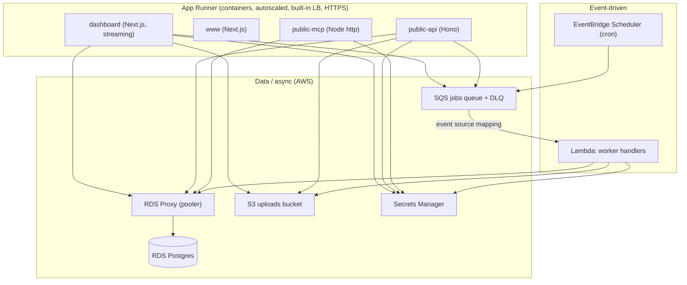

# AWS (Pulumi) — App Runner Profile

App Runner + Lambda + RDS Postgres + RDS Proxy across three environments: sandbox, staging, and production.

Two Pulumi projects live here:

| Project | Path | What it owns |
|---------|------|--------------|
| `starter-aws-core` | `infra/aws/core/` | VPC, RDS Postgres, RDS Proxy, SQS jobs queue + DLQ, S3 uploads bucket, Secrets Manager entries, EventBridge Scheduler rules, compliance resources |
| `starter-aws-apps` | `infra/aws/apps/` | 4 App Runner services (dashboard, www, public-api, public-mcp), workers Lambda, App Runner VPC connector |

`apps` depends on `core` via `pulumi.StackReference`. Deploy `core` first.

---

## Architecture



### Component mapping

| App | Target | Public | Needs DB | Needs SQS | Needs S3 |
|-----|--------|--------|----------|-----------|----------|
| `dashboard` | App Runner | ✓ | ✓ | ✓ (producer) | ✓ |
| `www` | App Runner | ✓ | — | — | — |
| `public-api` | App Runner | ✓ | ✓ | ✓ (producer) | ✓ |
| `public-mcp` | App Runner | ✓ | ✓ | — | — |
| `workers` | Lambda (SQS-triggered) | — | ✓ | ✓ (consumer) | ✓ |

### Workers Lambda

The workers service runs as an SQS-triggered Lambda container image with handler `lambda.handler`. An EventSourceMapping with `ReportBatchItemFailures` and `batchSize: 10` provides partial-batch failure semantics — a record that throws is reported via `batchItemFailures` and redrives to the DLQ (`maxReceiveCount: 5`) rather than blocking the batch. The poller-based entrypoint (`apps/workers/src/index.ts`) remains intact for other profiles.

### Scheduled jobs

An EventBridge Scheduler rule enqueues the `cleanup.expired-sessions` job to SQS on cron `0 3 * * *`. Additional repeatable jobs follow the same pattern: one scheduler rule enqueues one SQS message; the workers Lambda consumes it.

---

## Network topology (same in every environment)

**All environments — sandbox, staging, and production — share one network topology.** RDS is always private, RDS Proxy is always in-VPC, App Runner always uses a VPC egress connector, and Lambda always runs in private subnets. A NAT gateway (plus a free S3 gateway endpoint) handles egress. `complianceMode` toggles compliance *features* layered on top of this constant topology; it never changes how the app connects, so a deploy that passes in sandbox exercises the same network paths as production.

| Aspect | All environments (constant) | Extra when `complianceMode != none` |
|--------|-----------------------------|--------------------------------------|
| RDS | Private subnets, RDS Proxy in-VPC | Multi-AZ, CMEK at rest |
| App Runner → DB | VPC egress connector → RDS Proxy | WAF WebACL (see known limitations) |
| Lambda | In-VPC, private subnets | — |
| Egress | Single NAT gateway + free S3 gateway endpoint | Per-AZ HA NAT + interface VPC endpoints (SQS / Secrets Manager / KMS / ECR / Logs) |
| Encryption in transit | TLS (`sslmode=require`), HTTPS | Enforced via policy |
| Audit / logging | Baseline CloudWatch | CloudTrail data events, VPC Flow Logs, Object-Lock log bucket |

Accepted trade-off: the single topology adds ~$32/mo (one NAT gateway) to sandbox/staging compared with a two-topology design; production already carried NAT and is unchanged.

---

## Compliance features (`complianceMode` toggles)

`complianceMode` is set per environment in `infra/aws/config.<env>.ts`. It layers features onto the constant topology but does **not** change network connectivity.

| `ComplianceConfig` flag | AWS mapping |
|-------------------------|-------------|
| `cmek` | KMS CMKs for RDS, S3 (SSE-KMS), SQS, Secrets Manager, CloudWatch Logs |
| `auditLogs` | CloudTrail trail with data events (S3, Secrets Manager); VPC Flow Logs |
| `immutableLogSink` | S3 log bucket with Object Lock (compliance mode), retention = `logRetentionDays` |
| `logRetentionDays` | CloudWatch Logs retention + S3 Object Lock retention |
| `orgPolicies` | AWS Config managed rules (deny public RDS, require encryption, etc.) |
| `cloudArmor` | AWS WAF WebACL (see known limitations below) |
| `vpcServiceControls` | Interface VPC endpoints (PrivateLink) for AWS APIs |

When `complianceMode: "none"` (sandbox default) the compliance module is a no-op and registers no extra resources.

### Known limitations

**WAF WebACL association for public App Runner services is currently inert.** The core compliance module creates the WebACL but does not yet export its ARN for use by the apps layer. As a result, WAF is not actively filtering traffic even when `complianceMode` is `soc2` or `hipaa`. This is a known gap tracked for a follow-up; do not treat WAF as active until the ARN export and association are wired up.

---

## Database connection pooling

Runtime traffic uses a **pooled** connection through RDS Proxy; schema migrations use a **direct** connection to the RDS instance:

| Secret | Endpoint | Used by |
|--------|----------|---------|
| `DATABASE_URL` | RDS Proxy `:5432` (pooled) | App Runner services, Lambda at runtime |
| `DIRECT_URL` | RDS instance (direct) | `prisma migrate deploy` only |

Both secrets live in Secrets Manager and are injected at runtime via IAM. The Prisma client uses `DATABASE_URL`; Prisma Migrate uses `DIRECT_URL`. Cap the pg pool `max` per process to bound connections through the proxy.

---

## Hybrid mode: Vercel apps + AWS data/AI plane

For a Vercel-hosted frontend that uses this AWS data/AI plane **without** Vercel
Secure Compute, `core` provisions two extra pieces (design spec:
[`docs/superpowers/specs/2026-07-10-vercel-aws-hybrid-data-ai-plane-design.md`](../../docs/superpowers/specs/2026-07-10-vercel-aws-hybrid-data-ai-plane-design.md)):

| Piece | Module | Purpose |
|-------|--------|---------|
| Vercel OIDC access role | `core/vercel-access.ts` | Keyless, least-privilege role Vercel assumes (S3 uploads, SQS produce, app secrets, Bedrock InvokeModel). Created when `access.vercelOidc.teamSlug` is set. |
| Public PgBouncer pooler | `core/pgbouncer.ts` | Transaction-mode PgBouncer (Fargate, private subnets) behind a public NLB on `:6432`. RDS and RDS Proxy stay private — PgBouncer is the only public DB surface. Created when `database.pooler.enabled`. |

Bedrock is a public regional API: the Vercel role and the in-AWS App Runner /
Lambda roles get `bedrock:InvokeModel*` scoped to `ai.bedrockModels`. See
[infra/vercel/README.md](../vercel/README.md) for the Vercel-side wiring
(`AWS_ROLE_ARN`, `AWS_REGION`, pooled `DATABASE_URL`).

### Connection paths

| Consumer | Postgres path | Auth |
|----------|---------------|------|
| Vercel apps | public NLB `:6432` → PgBouncer → private RDS | OIDC role + `sslmode=verify-full` |
| In-AWS App Runner / Lambda | private RDS Proxy `:5432` → RDS | task role |

### Bedrock invocation logging (deploy step)

The pinned `@pulumi/aws` does not expose the model-invocation logging resource,
so enable prompt/completion logging once per account/region after `pulumi up`:

```sh
aws bedrock put-model-invocation-logging-configuration --logging-config '{
  "cloudWatchConfig": { "logGroupName": "/starter/<env>/bedrock-invocations", "roleArn": "<bedrock-logs-role-arn>" },
  "textDataDeliveryEnabled": true, "embeddingDataDeliveryEnabled": true
}'
```

CloudTrail already records Bedrock control-plane management events.

---

## Per-environment cost estimate

Indicative monthly figures, low traffic, `us-east-1`, single topology.

| Component | sandbox (`none`) | staging (`soc2`) | production (`soc2`/`hipaa`) |
|-----------|------------------|------------------|------------------------------|
| App Runner ×4 | ~$20 | ~$30 | ~$60–100 |
| RDS | ~$14 (micro, 1-AZ) | ~$27 (small, 1-AZ) | ~$100+ (medium, Multi-AZ) |
| RDS Proxy | ~$22 | ~$22 | ~$22 |
| NAT gateway | ~$32 (single) | ~$32 (single) | ~$65 (per-AZ HA) |
| Interface VPC endpoints | — | ~$22 | ~$44–88 |
| WAF / CloudTrail / KMS | — | ~$15 | ~$25 |
| Lambda + SQS + S3 | ~$2 | ~$3 | ~$10 |
| **≈ Total** | **~$90/mo** | **~$150/mo** | **~$300–380/mo** |

Source: `docs/superpowers/specs/2026-07-07-aws-apprunner-deploy-profile-design.md`. Cost is dominated by the RDS tier, which is tunable per env. No ALB, no cluster, no always-on compute beyond App Runner minimum instances.

---

## Configuration

Environments are defined in typed config files that mirror the GCP profile's pattern:

| File | Purpose |
|------|---------|
| `infra/aws/config.common.ts` | Shared invariants (region, domains, DB version), `complianceMode: "none"` base |
| `infra/aws/config.sandbox.ts` | `complianceMode: "none"`, smallest RDS (single-AZ), single NAT |
| `infra/aws/config.staging.ts` | `complianceMode: "soc2"`, single-AZ RDS, single NAT |
| `infra/aws/config.production.ts` | `complianceMode: "soc2"` or `"hipaa"`, Multi-AZ RDS, per-AZ HA NAT, WAF, monitoring |

Config type is defined in `infra/shared/aws-env-config.ts`. Config files are secret-free and safe to commit; real secrets live in Secrets Manager.

---

## Prerequisites

- [Pulumi CLI](https://www.pulumi.com/docs/install/) installed
- [AWS CLI](https://aws.amazon.com/cli/) installed and configured (`aws configure` or environment credentials)
- An AWS account with billing enabled
- An ECR repository for Docker images

See [infra/README.md](../README.md) for AWS startup credits and credit programs.

---

## First-time setup

These projects are not in the pnpm workspace root. Install deps inside each project directory:

```sh
cd infra/aws/core
pnpm install
pulumi stack init sandbox
pulumi config set aws:region us-east-1
pulumi config set starter-aws-core:env sandbox

cd ../apps
pnpm install
pulumi stack init sandbox
pulumi config set aws:region us-east-1
pulumi config set starter-aws-apps:env sandbox
pulumi config set starter-aws-apps:coreStackRef <org>/starter-aws-core/sandbox
pulumi config set starter-aws-apps:imageRegistry <account-id>.dkr.ecr.us-east-1.amazonaws.com/starter
```

Repeat for `staging` and `production` stacks. Resource sizing and compliance features derive from the typed config files — no manual `pulumi config set` per resource needed beyond the above.

---

## Deploy

```sh
# 1. Core infrastructure (VPC, RDS, Proxy, SQS, S3, Secrets Manager)
cd infra/aws/core
pulumi up -s sandbox

# 2. App services (App Runner, Lambda — reads outputs from core)
cd ../apps
pulumi up -s sandbox
```

---

## GitHub Actions deploy

The workflow at `.github/workflows/deploy-aws.yml` automates image builds and deploys for all environments. OIDC authentication is used; no long-lived AWS access keys are stored.

### Workflow steps

1. **build-images** — builds all 5 app images (dashboard, www, public-api, public-mcp, workers) and pushes to ECR, SHA-tagged.
2. **migrate** — runs `prisma migrate deploy` against `DIRECT_URL_DEPLOY` (direct RDS instance connection). This is a gate; deploy does not proceed if migrations fail.
3. **deploy core** — `pulumi up` core stack (VPC, RDS, Proxy, SQS, S3, Secrets Manager).
4. **deploy apps** — `pulumi up` apps stack (App Runner rolling deploys pinned to `github.sha`, Lambda update + publish).
5. **smoke test** — `GET /api/health` on the dashboard App Runner service.

Production deploys are gated by the `production-aws` GitHub Environment (required reviewers).

### Required secrets

| Secret | Description |
|--------|-------------|
| `AWS_DEPLOY_ROLE_ARN` | ARN of the IAM role GitHub Actions assumes via OIDC, e.g. `arn:aws:iam::123456789012:role/github-deploy` |
| `PULUMI_ACCESS_TOKEN` | Pulumi Cloud personal/org access token |
| `DIRECT_URL_DEPLOY` | Direct Postgres connection string (RDS instance, not proxy) used by `prisma migrate deploy` |

Note: `DATABASE_URL_DEPLOY` is **not** used by the migrate step. The migrate step requires a direct connection to the RDS instance (`DIRECT_URL_DEPLOY`).

### Required variables

| Variable | Example |
|----------|---------|
| `AWS_REGION` | `us-east-1` |
| `AWS_ECR_REGISTRY` | `123456789012.dkr.ecr.us-east-1.amazonaws.com/starter` |

### GitHub OIDC with AWS IAM

Create an IAM OIDC identity provider for `token.actions.githubusercontent.com`. The deploy role needs these policies:

- `AWSAppRunnerFullAccess`
- `AWSLambda_FullAccess`
- `AmazonRDSFullAccess`
- `AmazonSQSFullAccess`
- `SecretsManagerReadWrite`
- `AmazonEC2ContainerRegistryPowerUser`
- `AmazonS3FullAccess`
- `AmazonEC2FullAccess` (scoped to VPC/networking actions)
- `AWSKeyManagementServicePowerUser` (when `complianceMode != none`)
- `AWSCloudTrail_FullAccess` (when `complianceMode != none`)
- `AWSWAFFullAccess` (when `complianceMode != none`)
- `AWSConfigUserAccess` (when `complianceMode != none`)
- `IAMFullAccess` (or a narrower custom policy for role/policy management)

Setup guide: <https://docs.aws.amazon.com/IAM/latest/UserGuide/id_roles_providers_create_oidc.html>

### Manual deploy

```sh
gh workflow run deploy-aws.yml -f stack=sandbox
```

### GitHub Environment: `production-aws`

Create the environment at **Settings → Environments → New environment** and add required reviewers. The deploy job pauses for approval before applying changes to production.

---

## Zero-downtime deploys

- **App Runner** performs rolling deploys; traffic shifts only after the new instance passes health checks.
- **Lambda** publishes a new version atomically; the event source mapping points to the alias, which is updated after publish.
- **Migrations** run before any image update (expand/contract pattern required).
- **Rollback** = redeploy the previous SHA-pinned image (App Runner) or invoke the previous Lambda version. App Runner has no native canary/blue-green; rollback is a rolling redeploy (minutes). SHA-pinned tags make this fast and deterministic.
- **RDS Proxy** smooths Multi-AZ failover by holding and queuing connections during the brief failover window.

---

## Billing alerts (mandatory)

Configure budget alerts before your first deploy. Runaway RDS or NAT costs can accumulate quickly.

```sh
aws budgets create-budget \
  --account-id <AWS_ACCOUNT_ID> \
  --budget '{
    "BudgetName": "starter-aws-budget",
    "BudgetLimit": { "Amount": "100", "Unit": "USD" },
    "TimeUnit": "MONTHLY",
    "BudgetType": "COST"
  }' \
  --notifications-with-subscribers '[
    {
      "Notification": {
        "NotificationType": "ACTUAL",
        "ComparisonOperator": "GREATER_THAN",
        "Threshold": 80
      },
      "Subscribers": [{ "SubscriptionType": "EMAIL", "Address": "your@email.com" }]
    }
  ]'
```

Also enable **Cost Anomaly Detection** in the AWS Cost Management console.

Docs: <https://docs.aws.amazon.com/cost-management/latest/userguide/budgets-managing-costs.html>

---

## Startup credits

See [infra/README.md](../README.md) — the AWS Activate program provides up to $100,000 in AWS credits for eligible startups.

AWS Activate: <https://aws.amazon.com/activate/>
